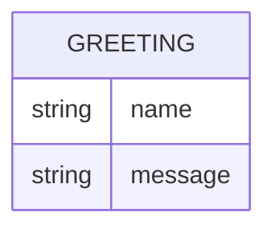

# Domain Model

Greeter has a single, transient concept: the greeting produced for a requested
name. Nothing is persisted.

`GREETING` is not stored — it is computed per request and returned directly in
the response body.